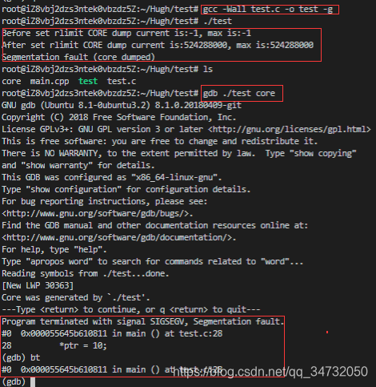
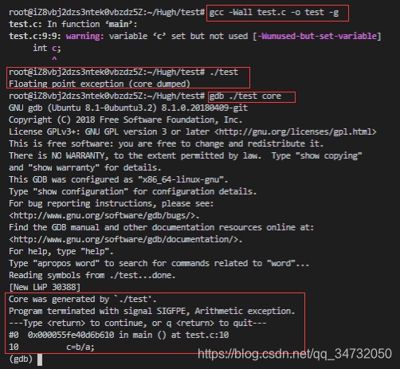
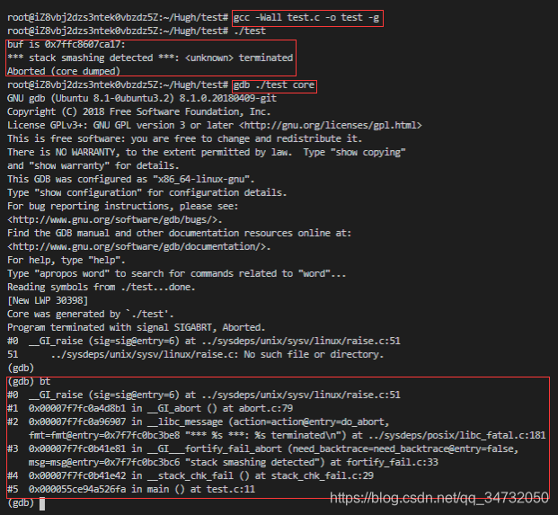

## CoreDump
> coredump是指当程序出错而异常中断时，OS会把程序工作的当前状态存储成一个coredunmp文件。通常情况下coredump文件包含了程序运行时的内存，寄存器状态，堆栈指针，内存管理信息等。[百度百科](https://baike.baidu.com/item/coredump/10713566?fr=aladdin)

## 常见造成程序coredump的原因
1. 内存访问越界（比如数组下标越界）
2. 堆栈溢出（使用了过大的局部变量，因为局部变量存储在栈中，容易导致溢出；函数递归的深度太大等等）
3. 非法指针（比如随意的强制转换指针的类型，或者使用了空指针（清理数据时，释放了指针所指向的内存地址，但没有将指针置空，导致其成为野指针。））
4. 多线程读写的数据未加锁保护。
5. 多线程程序使用了线程不安全的函数（比如strtok、gethostbyname等）。

## 设置生成coredump文件
```bash
root@iZ8vbj2dzs3ntek0vbzdz5Z:~/Hugh/test# ulimit -c
0
```
在Linux环境下，需要设置。这里输出结果为0，则表示未开启coredump功能。

```bash
ulimit -c unlimited
```
开启coredump功能，并且不限制coredump文件大小。
备注：重启开机后，该设置需要重新设定，避免程序不断产生coredump文件。
再次输入
```bash
root@iZ8vbj2dzs3ntek0vbzdz5Z:~/Hugh/test# ulimit -c
unlimited
```
## 常用gdb来调试coredump问题

```bash
gdb program corefile #program 为可执行的程序;corefile为对应的core文件
bt(backtrace)命令（或者where）#查看对应出错的位置
启动gdb,注意该程序编译需要-g选项进行。
```

```c
#include <unistd.h>
#include <sys/time.h>
#include <sys/resource.h>
#include <stdio.h>
#define CORE_SIZE   1024 * 1024 * 500
int main()
{
    struct rlimit rlmt;
    if (getrlimit(RLIMIT_CORE, &rlmt) == -1) {
        return -1; 
    }   
    printf("Before set rlimit CORE dump current is:%d, max is:%d\n", (int)rlmt.rlim_cur, (int)rlmt.rlim_max);

    rlmt.rlim_cur = (rlim_t)CORE_SIZE;
    rlmt.rlim_max  = (rlim_t)CORE_SIZE;

    if (setrlimit(RLIMIT_CORE, &rlmt) == -1) {
        return -1; 
    }   

    if (getrlimit(RLIMIT_CORE, &rlmt) == -1) {
        return -1; 
    }   
    printf("After set rlimit CORE dump current is:%d, max is:%d\n", (int)rlmt.rlim_cur, (int)rlmt.rlim_max);

    /*测试非法内存，产生core文件*/
    int *ptr = NULL;
    *ptr = 10; 

    return 0;
}
```



通过查看core文件，发现错误的地方在 main函数里面。
输入bt或where可以显示出所有的堆栈信息。

## 常见错误举例
1. 除0错误
除零错误、参数为空指针、迭代器失效等问题属于程序堆栈本身代码出错，可以通过gdb查看
```c
#include <unistd.h>
#include <sys/time.h>
#include <sys/resource.h>
#include <stdio.h>
int main()
{
    int a=0;
    int b=1;
    int c;
    c=b/a;
    return 0;
}
```



2. 内存越界

```c
#include <stdio.h>
#include <stdlib.h>
#include <string.h>
int main()
{
    char buf[1];
    buf[1]=1;
    //strcpy(buf,"111111111");
    printf("buf is %p:%s\n",buf,buf);
    return 0;
}
```


## 参考链接

[C++中Segmentation fault(Core Dump)错误处理](https://www.cnblogs.com/java20130726/p/3218455.html)
[Linux下core dump](https://www.cnblogs.com/s-lisheng/p/11278193.html)
