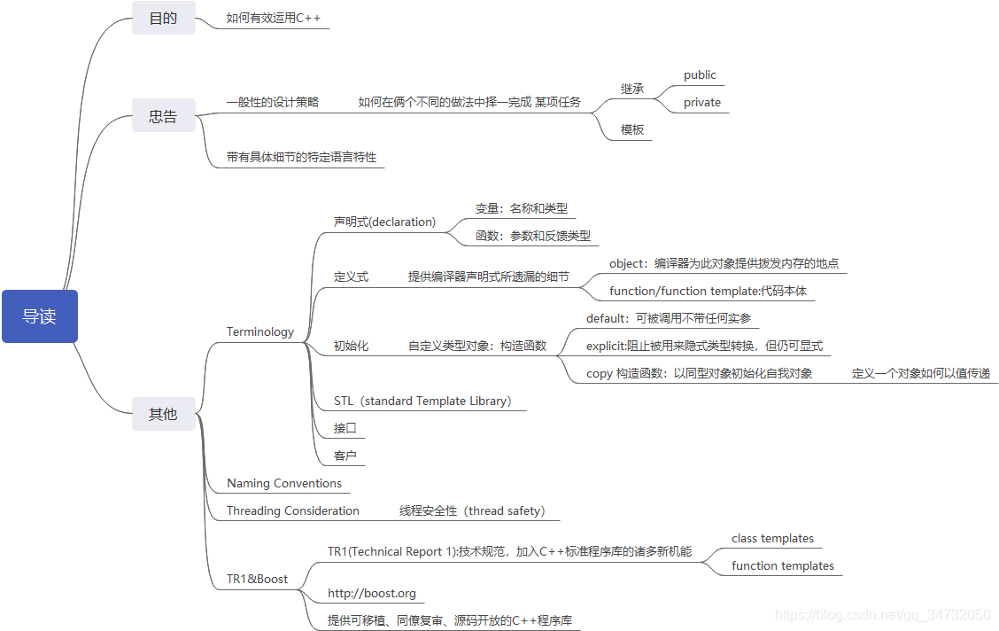
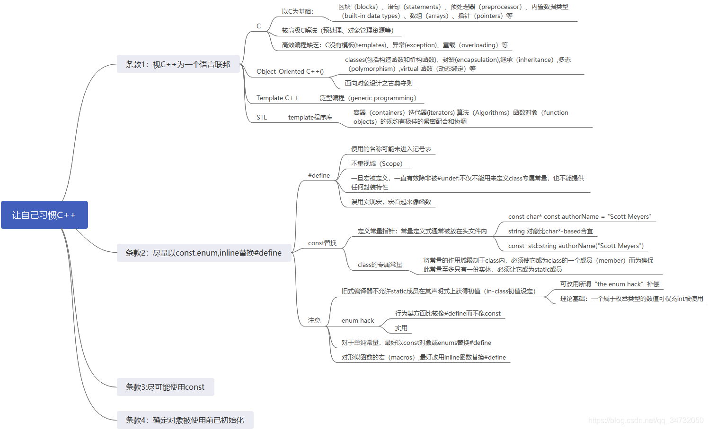
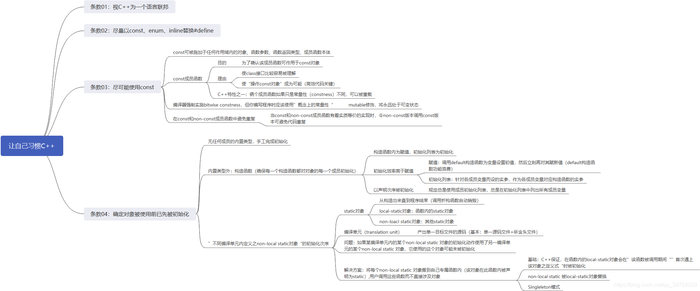

### 条款02：尽量以const,enum,inline替换#define
##### 为什么尽量不用#define？
（1）#define的记号名称可能在编译器处理源码时就已经被预处理器移走了，记号名称未能进入记号表，从而可能获得编译错误的信息。如果又是定义在非你所写的头文件中，你更将毫无概念，并耗时追踪。
（2）无法用#define创建一个class专属常量，#define并不注重于（scope），一旦编译除非#undef,定义区间均有效。因此，无法提供任何封装性。
（3）以#define实现宏时,格式可能较为繁琐，，易出错，且效率难以保障。
```cpp
#define CALL_WITH_MAX(a,b) f((a)>(b) ? (a):(b))
```

```cpp
int a = 5; int b = 0;
CALL_WITH_MAX(++a,b); #a被累加2次
CALL_WITH_MAX(++a,b+10);#a被累加1次
```

在这里，f调用前，a的递增次数会取决于“它被拿来和谁比较”

###### 尽量多的使用const,enum,inline
###### const
(1) 使用常量可能比用#define导致较小的代码量
(2) 可以作为class的专属常量，static 从上图，可以确保此常量至多只有一份实体
###### enum
(1) 某些行为较像#define 而不像const,取#define的地址也不合法，取enum的地址不合法，因此约束指针指向，同时于#define一样不会导致非必要的内存分配
(2) 实用，“enum hack”是templat metaprogramming（模板元编程）的基础技术
###### inline
可以获得宏带来的效率以及一般函数的所有可预料行为和类型安全，只要你写出template inline函数。


### 条款03：尽可能用const
##### const的作用
（1）变量
常量，该变量不可被修改, 因此定义时必须被初始化
（2）指针
常量指针和指针常量
允许非const对象的地址赋给指向const对象的指针
因此可以简单的理解为，谁被const修饰，谁就不能改变。没有被修饰的不可轻易下结论。
```cpp
#常量指针
const int a = 0;
const int *p = &a; # p本身并不是常量，*p是指向 const int的指针,因此*p可以被重新赋值，或者更改指向
#指针常量
int a = 0;
int* const p = &a; # p是指向int类型的指针，p本身是常量，不可被修改
#指向常量的指针常量
const int a = 0;
const int* const p = &a;
```
（3）参数
避免了拷贝，又避免了函数对值的修改
```cpp
void display(const int &a); 
void print(const int a); #避免对函数值的修改
```
（4）函数
```cpp
class A
{
public:
	void display();
	void display() const;# (1) 可用于区分重载
	void print() const;# (2) 常成员函数在函数体内不能对成员变量进行修改
	const int misp(); # (3) 修饰返回值，返回值为常量不可修改
	const int *mis();
}
```

##### const && static

### 条款04：确定对象使用前已经被初始化

## 构造/析构/赋值运算
### 条款05：了解C++默默编写并调用哪些函数
### 条款06：若不想使用编译器自动生成的函数，就该明确拒绝
### 条款07：为多态基类声明virtual析构函数
**问题**：对于具有多态性质的基类，在没有virtual析构函数的情况下，派生类的对象会经由一个基类指针被删除，其中基类成分通常会被销毁，但派生类很可能没被销毁，这就造成了一个”局部销毁“的对象，可能引起资源泄露。
**解决**：给基类添加一个virtual析构函数。virtual函数的目的是允许派生类的实现得以客制化，在不同的派生类中有对应不同的实现码。
**注意**：classes的设计目的如果不是作为基类使用，或者不是为了具备多态性质，就不该声明virtual函数。virtual函数的实现会使对象的体积增加约50%-100%，因此可能不再能传递给其他语言所写的函数。
**总结**：带多态性质的基类应该声明一个virtual析构函数，如果类中有任何virtual函数，它就应该拥有一个virtual析构函数。
### 条款08：别让异常逃离析构函数
**问题**：在析构函数中吐过抛出异常可能会导致剩下的析构工作未完成，出现资源泄露。
**解决**：
方案1：抛出异常时粗暴结束，常常通过abort完成；
方案2：吞下异常并记录异常；
方案3：设计接口使得用户对可能出现的异常做出反应。
**注意**：如果客户需要对某个操作函数进行运行期间抛出的异常作出反应，那么class应该提供一个普通函数（而非在析构函数中）执行操作。
**总结**：析构函数绝对不要吐出异常，如果一个析构函数调用的函数可能抛出异常，析构函数应该捕捉任何异常，然后吞下它们（不传播）或结束程序。
### 条款09：绝不在构造和析构过程中调用virtual函数
**问题**：在派生类对象的基类构造期间对象的类型是基类而不是派生类
**注意**：在基类构造期间，virtual函数不是virtual函数
**总结**：在构造和析构期间不要调用virtual函数，因为这类调用从不下降至派生类（比起当前执行构造函数和析构函数的那层）。
### 条款10：令operato= 返回一个reference to *this
**说明**：实现赋值操作符时应该遵循的协议（实现“连锁赋值”：a = b = c = 20）
**总结**：令赋值操作符返回一个 reference to *this。
### 条款11：在operator= 中处理“自我赋值
**问题**：自我赋值时容易掉进“在停止使用资源之前意外释放了它”的陷阱

```cpp
class Bitmap{...};
class Widget{
...
private:
	Bitmap* pb;              //指针，指向一个从heap分配而得的对象
}
Widget& Wisget:: operator=(const Widget& rhs)
{
	delete pb;               //停止使用当前的bitmap
	pb = new Bitmap(*rhs.pb);//使用rhs‘s bitmap的副本
	return *this;           
}
```
这里operator= 函数内的*this（赋值目的端）和rhs有可能是同一个对象，在这种情况下，delete就不只是销毁当前对象的bitmap,它也销毁rhs的bitmap,最后this会指向一个被删除的对象。
**解决**：
方案一(传统做法):判断是否是自我赋值（“证同测试”）
方案二：在复制pb所指东西之前别删除pb
```cpp
Widget& Widget::operator=(const Widget& rhs)
{
	Bitmap* pOrig = pb;
	pb = new Bitmap(*rhs.pb);
	delete pOrig;
	return *this;
}
```
方案三：copy and swap
```cpp
Widget& Widget::operator=(const Widget rhs) //rhs被传递时是一份副本
{                                           //这里是值传递
	swap(rhs);                              //将*this的数据和复件的数据互换
	return *this;                           
}
```

（1）某class的拷贝赋值操作符可能被声明为“以值方式接受实参”；
（2）值传递会造成一份副本
**注意**：确定任何函数如果操作一个以上的对象，而其中多个对象是同一个对象时，其行为仍然正确。
**总结**：确保当对象自我赋值时 operator= 有良好行为，其中技术包括比较“来源对象”和“目标对象”的地址，精心周到的语句顺序，以及copy-and-swap。

### 条款12：复制对象时勿忘其每一个成分
**注意**：不要尝试以某个copying函数实现另一个copying函数，应该将共同机能放进第三个函数中，并由俩个copying函数共同调用。
**总结**：Copying函数应该确保复制“对象内的所有成员变量”及“所有基类成分”

## 资源管理
### 条款13：以对象管理资源
**问题**：单纯依赖某个函数总会去执行delete语句“是行不通的，中途可能由于continue，goto等操作使得delete语句被跳过去，引发资源泄露
**解决**：将资源放进对象内，当控制流离开f函数，该对象的析构函数会自动释放那些资源。
**注意**：俩个常被使用的RAIL classes分别是tr1::shared_ptr和auto_ptr,前者通常是较佳选择，因为其copy行为较为直观，若选择auto_ptr,复制动作会使它（被复制物）指向NULL.
**总结**：为防止资源泄露，请使用RAIL对象，它们在构造函数中获得资源并在析构函数中释放资源
### 条款14：在资源管理类中小心copying行为
**说明**：RAII（Resource Acquisition Is Intialization）:资源取得时机便是便是初始化时机。
**注意**：普遍而常见的RAII class copying 行为是： 抑制copying、施行引用计数法（reference counting）。不过其他行为也都可能被实现。
**总结**：复制RAII对象必须一并复制它所管理的资源，所以资源的copying行为决定RAII对象的copying行为。
### 条款15：在资源管理类中提供对原始资源的访问
**注意**：对原始资源的访问可能经由显式转换或隐式转换。一般而言显式转换比较安全，但隐式转换对客户比较方便。
**总结**：APIs往往要求访问原始资源，所以每一个RAII class 应该提供一个“取得其所管理之资源”的办法
### 条款16：成对使用new和delete时要采取相同形式
**总结**：如果你在new表达式中使用[ ],必须在相应的delete表达式中也使用[ ]。如果你在new表达式中不使用[ ],一定不要在相应的delete表达式中使用[ ]。

### 条款17：以独立语句将newed对象置入智能指针
**总结**：以独立语句将newed对象存储于智能指针内，如果不这样做，一旦异常被抛出，有可能导致难以察觉的资源泄露。

## 设计与声明
### 条款18：让接口容易被正确使用，不易被误用
**问题**：
接口可能出现的错误：
（1）或许会以错误的次序传递参数
（2）可能传递一个无效的参数

**解决**：
（1）限制类型内哪些可以做，哪些不能做(常见的限制是加上const)
（2）先发制人，由于客户可能会有着“不正确的使用倾向”，比如忘记通过智能指针来管理某些动态分配的对象，那么就令factory函数返回一个智能指针。
**注意**：
（1）"促进正确使用"的办法包括一切接口的一致性，以及与内置类型的行为兼容。
（2）“阻止误用”的办法包括建立新类型，限制类型上的操作，束缚对象值，以及消除客户的资源管理责任。
（3）tr1::shared_ptr支持定制型删除器（custom deleter）。这可防范DLL问题，可被用来自动解除互斥锁（mutexes）等等。
**总结**：好的接口很容易被正确使用，不容易被误用。你应该在你的所有接口中努力达成这些性质。
### 条款19：设计class犹如设计type
**总结**：class的设计就是type的设计，在定义一个新的type之前，请确定你已经考虑过本条款覆盖的所有讨论问题。
### 条款20：宁以pass-by-reference-to-const替换pass-by-value
**问题**：对一般函数而言，对象参数的传递成本是“一次拷贝构造+一次析构调用”，其中对象内有几个成员，或者对象，也会增加传递成本。与此同时，引用传参的效率要高的多，没有任何构造函数的析构函数被调用，因为没有任何对象被创建，同时参数声明为const，避免参数被改变。7 
**总结**：尽量以pass-by-reference-to-const替换pass-by-value.前者通常比较高效，并可避免切割问题（splice problem）。
**注意**：以上规则并不适用内置类型，以及STL的迭代器和函数对象。对它们而言，pass-by-value往往比较适当。
### 条款21：必须返回对象时，别妄想返回其reference
**总结**：绝不用返回pointer或reference指向一个local stack对象，或返回reference指向一个heap-allocated对象，或返回pointer或reference指向一个local static对象而言而有可能同时需要多个这样的对象。
### 条款22：将成员变量声明为private
**注意**：protected并不比private更具有封装性
**总结**：切记将成员变量声明private。这可赋予客户访问数据的一致性、可细微划分访问控制、允许约束条件获得保证，并提供class作者以充分的实现弹性。
### 条款23：宁以non-member、non-friend替换member函数
**总结**：宁以non-member、non-friend替换member函数，这样做可以增加封装性，包裹弹性（package flexibility）和机能扩充性。
### 条款24：若所有参数皆需要类型转换，请为此采用non-member函数
**总结**：如果你需要为某个函数的所有参数（包括被this指针所指的那个隐喻参数）进行类型转换，那么这个函数必须是个non-member。
### 条款25：考虑写出一个不抛出异常的swap函数
**注意**：
（1）如果你提供一个member swap，也该提供一个non-member swap用来调用前者。对于class(而非templates),也请特化std::swap
（2）调用swap时针对std::swap使用using声明式，然后调用swap并且不带任何“命名空间资格修饰”。
（3）为“用户定义类型”进行是std::templates全特化是好的，但千万不要尝试在std内加入某些对std而言全新的东西。
**总结**：当std::swap对你的类型效率不高时，提供一个swap成员函数，并确定这个函数不抛出异常

## 实现
### 条款26：尽可能延后变量定义式的出现时间
**问题**：变量定义式会带来构造和析构的成本，一旦定义变量的该函数抛出异常，你仍得夫付出变量定义的构造和析构成本。
**注意**：不只是延后变量的定义，直到非得使用该变量的前一刻为止，甚至应该尝试延后这份定义，直到能够给它初值实参为止。如果这样，不仅能够避免构造（和析构）非必要对象还可以比避免无意义的deafult构造行为。更深一层说，以”具明显意义之初值“将变量初始化，还可以附带说明变量的目的。

**总结**：尽可能延后变量定义式的出现，这样做会增加程序的清晰度并改善程序效率

### 条款27：尽可能少做转型动作
**说明**：
（1）C++规则的设计目标之一是，保证”类型错误“绝不可能发生
（2）旧式转换：T（expression） （T）expression
（3）新式转换：const_cast&dynamic_cast&reinterpret_cast&static_cast

**注意**：
（1）任何一个类型转换（不论是通过转型操作而进行的显式转换，或通过编译器完成的隐式转换）往往真的令编译器编译出运行期间执行的码。
其中新式转换较为欢迎，原因：
（1）代码中易辨识
（2）各转型动作的目标愈窄化，编译器愈能诊断出错误的运用

（1）const_cast通常被用来将对象的常量性去除，也是唯一具有此能力的C++ style转型操作符
（2）dynamic_cast主要用来执行“安全向下转型”，也就是用来决定某对象是否归属体系中的某个类型，他是唯一无法由旧式语法执行的动作，也是唯一可能消耗重大运行成本的转型动作
（3）reinterpret_cast意图执行低级转型，实际动作可能取决于编译器，这也就表示它不可移植，
（4）static_cast用来强迫隐式转换

**总结**：
（1）如果可以，尽量避免转型，特别是在注重效率的代码中避免dynamic_casts。如果有这个设计需要转型动作，试着发展无需转型的替代设计
（2）如果转型是必要的，试着将它隐藏于某个函数背后，客户随后可以调用该函数，而不需要将转型放进他们自己的代码内。
（3）宁可使用C++style（新式）转型，不要使用旧式转型。前者很容易辨识出来，而且也比较有着分门别类的执掌。
### 条款28：避免返回handles指向对象内部成分
**问题**：Reference,指针，迭代器统统都是所谓的handles（号码牌，用来取得某个对象），而返回一个”代表对象内部“的handle,随之而来的式”降低对象封装性“的风险。同时，它也可能导致”虽然调用const成员函数却造成对象状态被更改“。
**解决**：
留心不要返回他们的handles,对const成员函数的返回类型加上const
**总结**：
避免返回handles,（包括references，指针，迭代器）指向对象内部。遵守这个条款可增加封装性，帮助const成员函数的行为像个const,并将发生“虚吊号码牌”（dangling handles）的可能性降至最低。
### 条款29：为“异常安全”而努力是值得的
**总结**：
（1）异常安全函数（Exceptional functions）即使发生异常也不会泄露资源或允许任何数据结构破坏，这样的函数区分为三种可能的保证：基本型，强烈型，不抛异常型。
（2）“强烈保证”往往能够实现以copy-and-swap实现出来，但“强烈保证”并非对所有函数都可实现或具备现实意义。
（3）函数提供的“异常安全保证”通常最高只等于其所调用之各个函数的“异常安全保证”中的最弱者。
### 条款30：透彻了解inlining的里里外外
**说明**：
（1）inline函数背后的整体观念是，将”对此函数的每一个调用“都以函数本体替换之。
（2）过度热衷inlining会造成程序体积太大（对可用空间而言）。即使拥有虚内存，inline造成的代码膨胀亦会导致额外的换页行为（paging),降低指令高速缓存装置的击中率（instruction cache hit rate），以及伴随这些而来的效率损失。
（3）inline只是对编译器的一个申请，不是强制命令。这项申请可以隐喻提出，也可以明确提出，隐喻方式是将函数定义于class定义式内

```cpp
class Person{
public:
	int age()const {return theAge;}//一个隐喻的inline申请
								   //age被定义于class定义式内
private:
	int theAge;                    
}
```

**总结**：
（1）将大多数inlining限制在小型，被频繁调用的函数身上。这可使日后的调试过程和大多数二进制升级更容易，也可使潜在的代码膨胀问题最小化，使程序的速度提升机会最大化。
（2）不要只因为function templates出现在头文件，就将它们声明为inline
### 条款31：将文件间的编译依存关系降至最低
**说明**：接口与实现分离的关键在于”声明的依存性“替代”定义的依存性“，那正是编译依存性最小化的本质：现实中让头文件尽可能自我满足，万一做不到，则让它与其他文件内的声明式（而非定义式）相依。
**总结**：
（1）支持“编译依存性最小化”的一般构想是：相依存于定义式。基于此构想的俩个手段是handle class和Interface classes
（2）程序库头文件应该以“”完全且仅有声明式的形式存在，这种做法不论是否涉及templates都适用。

## 继承与面向对象设计
### 条款32：确定你的public继承塑模出is-a关系
**总结**：public继承意味is-a。适用于base classes身上的每一件事请也一定适用于derived classes身上，因为每一个derived classes对象也都是一个base classes对象。
### 条款33：避免遮掩继承而来的名称
**总结**：
（1）derived classes内的名称会遮掩base classes内的名称，在public继承下从来没有人希望如此。
（2）为了让被遮掩的名称再见天日，可使用using声明式或转交函数
### 条款34：区分接口继承和实现继承
**总结**：
（1）接口继承和实现继承不同。在public继承之下，派生类总是继承基类的接口
（2）纯虚函数只具体指定接口继承
（3）非纯虚函数具体指定接口继承及缺省实现继承
（4）non-virtual函数具体指定接口继承及强制性实现继承
### 条款35：考虑virtual函数以外的其他选择
**总结**：
（1）virtual函数的替代方案包括NVI手法及Strategy设计模式的多种形式。NVI手法自身是一个特殊形式的Template Method设计模式
（2）将机能从成员函数移到class外部函数，带来的一个缺点是，非成员函数无法访问class的non-public成员
（3）tr1::function对象的行为就像一般函数指针。这样的对象可接纳“与给定之目标签名式兼容”的所有可调用物（callable entities）。
### 条款36：绝不重新定义继承而来的non-virtual函数
**总结**：绝不重新定义继承而来的non-virtual函数

### 条款37：绝不重新定义继承而来的缺省参数值
**总结**：绝不重新定义继承而来的缺省参数值，因为缺省参数值都是静态绑定，而virtual函数-你唯一应该覆写的东西-却是动态绑定
### 条款38：通过复合塑模出has-a或“根据某物实现出”
**总结**：
（1）复合（composition）的意义和public继承完全不同
（2）在应用域（application domian），复合意味着has-a（有一个）。在实现域（implementation domain），复合意味着is-implementation-in-terms-of(根据某物实现出)
### 条款39：明智而审慎地使用private继承
**总结**：
（1）Private继承意味着is-implemented-in-terms-of（根据某物实现出）。它通常比复合（composition）的级别低，但是当derived-class需要访问protected base class的成员，或需要重新定义继承而来的virtual函数时，这么设计时合理的。
（2）和复合（composition）不同，private继承可以造成empty base最优化。这对致力于“对象尺寸最小化”的程序库开发者而言，可能很重要
### 条款40：明智而审慎地使用多重继承
**总结**：
（1）多重继承比单一继承复杂，它可能导致新的歧义性，以及对virtual继承的需要。
（2）virtual继承会增加大小，速度，初始化（及赋值）复杂度等等成本，如果virtual base classes不带任何数据，将是最具实用价值的情况。
（3）多重继承的确有正当用途，其中一个情节涉及“public”继承某个“Interface class”和“private继承某个协助实现的class”的俩相结合。
## 模型与泛型编程
### 条款41：了解隐式接口和编译期多态
**总结**：
（1）classes和templates都支持接口（interface）和多态（polymorphism）。
（2）对classes而言接口是显式的（explicit），以函数签名为中心。多态则是通过virtual函数发生于运行期。
（3）对template参数而言，接口是隐式的（implicit），奠基于有效表达式。多态则是通过template具现化和函数重载解析（function overloading resolution）发生于编译期
### 条款42：了解typename的双重意义
**总结**：
（1）声明template参数时，前缀关键字class和typename可互换
（2）请使用关键字typename标识嵌套从属类型名称；但不得在base class lists(基类列)或member intialization list（成员初值列）内以它作为base class修饰符。

### 条款43：学习处理模板化基类内的名称
**总结**：可在派生类内通过“this->”指涉base class templates内的成员名称，或藉由一个明白写出的“base class资格修饰符“完成。
### 条款44：将与参数无关的代码抽离
**总结**：
（1）Templates生成多个classes和多个函数，所以任何template代码都不该与某个造成膨胀的template参数产生相依关系
（2）因非类型模板参数（non-type template parameters）而造成的代码膨胀，往往可消除，做法是以函数参数或class成员变量替换template参数
（3）因类型参数（type parameters）而造成的代码膨胀，往往可降低，做法是让带有完全相同二进制表述（binary representation）的具现类型（instantiation tyes）共享实现代码
### 条款45：运用成员函数模板接受所有兼容类型
**总结**：
（1）请使用member function template(成员函数模板)生成”可接受所有兼容类型“的函数
（2）如果声明member templates用于”泛化copy构造“或”泛化assignment操作“你还是需要声明正常的copy构造函数和copy assignment操作符。
### 条款46：需要类型转换时请为模板定义非成员函数
**总结**：
当我们编写一个class template,而它所提供之”与此template相关的“函数支持”所有参数之隐式类型转换“时，请将那些函数定义为”class template内部的friend 函数”
### 条款47：请使用traits classes表现类型信息
**总结**：
（1）Traits classes使得“类型相关信息”在编译期可用，它们以templates和“templates特化”完成实现
（2）整合重载技术（overloading）后，traits classes有可能在编译期对类型执行if ...else...测试。
### 条款48：认识template元编程
**总结**：
（1）Template metaprogramming(TMP，模板元编程)可将工作由运行期移往编译期，因而得以实现早期错误侦测和更高的执行效率
（2）TMP可被用来生成“基于政策选择组合”（based on combrinations of policy choices）的客户定制代码，也可用来避免生成某些特殊类型并不适合的代码。

## 定制new和delete
### 条款49：了解new-handler的行为
**总结**：
（1）set_new_handler允许客户指定一个函数，在内存分配无法获得满足时被调用
（2）Nothrow new时一个颇为局限的工具，因为它只适用于内存分配：后继的构造函数调用还是可能抛出异常
### 条款50：了解new和delete的合理替换时机
**总结**：
有许多理由需要写个自定的new和delete，包括改善效能，对heap运用错误进行调试，收集heap使用信息。
### 条款51：编写new和delete时需要固守常规
**总结**：
（1）operator new 应该内含一个无穷循环，并在其中尝试分配内存，如果它无法满足内存需求，就应该调用new-handler。它也应该有能力处理0 bytes申请。class专属版本则还应该处理“比正确大小更大的（错误）申请”。
（2）operator delete应该在收到null指针时不做任何事。Class专属版本则还应该处理“比正确大小更大的（错误）申请”。
### 条款52：写了placement new 也要写 placement delete
**总结**：
（1）当你写一个placement operator new，请确定也写出对应的placement operator delete。如果没有这样做，你的程序可能会发生隐微而时断的内存泄露。
（2）当你声明placement new和placement delete,请不要无意识（非故意）地遮掩了他们的正常版本
## 杂项讨论
### 条款53：不要轻忽编译器的警告
**总结**：
（1）严肃对待编译器发出的警告信息。努力在你的编译器最高（最严苛）警告级别下争取“无任何警告”的荣誉
（2）不要过度依赖编译器的报警能力，因为不同的编译器对待事请的态度并不相同。一旦移植到另一个编译器上，你原本依赖的警告信息有可能消失。
### 条款54：让自己熟悉包括TR1在内的标准程序库
**总结**：
（1）C++标准程序库的主要机能由STL、iostreams、locales组成，并包含C99标准程序库
（2）TR1添加了智能指针（例如 tr1::shanred_ptr）、一般化函数指针（tr1::function）、hash-based容器、正则表达式（regular expressions）以及另外10个组件的支持
（3）TR1自身只是一份规范。为获得TR1提供的好处，你需要一份实物。一个好的实物来源是Boost
### 条款54：让自己熟悉Boost
**总结**：
（1）Boost时一个社群，也是一个网站，致力于免费、源码开放、同僚复审的C++程序库开发。Boost C++标准化过程中扮演深具影响力的角色。
（2）Boost提供许多TR1组件实现品，以及其他许多程序库.
