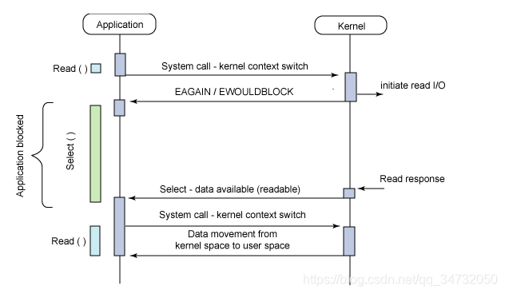

## IO多路复用浅析（Epoll、Poll、 Select）

>IO多路复用就是通过一种机制，一个进程可以监视多个描述符，一旦某个描述符就绪（一般是读就绪或者写就绪），能够通知程序进行相应的读写操作。但select,poll,epoll本质上都是同步I/O,因为他们都需要在读写事件就绪后自己负责进行读写，也就是说这个读写过程是阻塞的，而异步IO的实现会负责把数据从内核拷贝到用户空间。

```bash
查看man手册
man pagenum function //查看对应的函数原型， pagenum 为页数， function为函数名
如： man 2 select
```

## Select
```cpp
#include <sys/select.h>
/* According to earlier standards */
#include <sys/time.h>
#include <sys/types.h>
#include <unistd.h>
int select(int nfds, fd_set *readfds, fd_set *writefds,
			fd_set *exceptfds, struct timeval *timeout);

	//nfds: 		监控的文件描述符集里最大文件描述符加1，因为此参数会告诉内核检测前多少个文件描述符的状态
	//readfds：	    监控有读数据到达文件描述符集合，传入传出参数
	//writefds：	监控写数据到达文件描述符集合，传入传出参数
	//exceptfds：	监控异常发生达文件描述符集合,如带外数据到达异常，传入传出参数
	//timeout：	    定时阻塞监控时间，3种情况
				//1.NULL，永远等下去
				//2.设置timeval，等待固定时间
				//3.设置timeval里时间均为0，检查描述字后立即返回，轮询
	struct timeval {
		long tv_sec; /* seconds */
		long tv_usec; /* microseconds */
	};
	void FD_CLR(int fd, fd_set *set); 	//把文件描述符集合里fd清0
	int FD_ISSET(int fd, fd_set *set); 	//测试文件描述符集合里fd是否置1
	void FD_SET(int fd, fd_set *set); 	//把文件描述符集合里fd位置1
	void FD_ZERO(fd_set *set); 			//把文件描述符集合里所有位清0

```
调用过程如下：

fd_set如下所示：
types.sh

```bash
#ifndef FD_SETSIZE
#define FD_SETSIZE  1024
#endif
#define NBBY    8       /* number of bits in a byte */
typedef long    fd_mask;
#define NFDBITS (sizeof (fd_mask) * NBBY)   /* bits per mask */
#define howmany(x,y)    (((x)+((y)-1))/(y))
typedef struct _types_fd_set {
    fd_mask fds_bits[howmany(FD_SETSIZE, NFDBITS)];
} _types_fd_set;
```
fd_set就是long的数组，数组的大小取决于FD_SETSIZE/NFDBITS，如果1个long是8字节64位的话，fds_bits的大小就是16

1. 默认最大监听描述符个数为1024；但是可以通过内核编译来重设FD_SETSIZE，并且在linux下是FD_SETSIZE限制的是值，文件描述符值的大小不能大于1024
2. 每次调用时都需要将描述符和事件从用户空间拷贝到内核空间（copy_from_user）
3. 查询事件时采用遍历轮询的方式，select函数会修改readfds，writefds，exceptfds，如果一个文件描述符就绪，则为1，没就绪则为0，这样调用者要遍历整个位域，通过要通过FD_ISSET宏来找到就绪的文件描述符。时间复杂度 O(n)。

```bash
ulimit -n  //查看当前最大监听描述符设置
ulimit -n size //size:具体的值的大小，设置更改
```

## Poll
```cpp
#include <poll.h>
int poll(struct pollfd *fds, nfds_t nfds, int timeout);
struct pollfd {
	int fd;        /* 文件描述符 */
	short events;  /* 监控的事件 */
	short revents; /* 监控事件中满足条件返回的事件 */
};
	/*
	POLL事件类型
    The  bits that may be set/returned in events and revents are defined in <poll.h>:
	POLLIN			//普通或带外优先数据可读,即POLLRDNORM | POLLRDBAND
	POLLRDNORM		//数据可读
	POLLRDBAND		//优先级带数据可读
	POLLPRI 		//高优先级可读数据
	POLLOUT		    //普通或带外数据可写
	POLLWRNORM		//数据可写
	POLLWRBAND		//优先级带数据可写
	POLLERR 		//发生错误
	POLLHUP 		//发生挂起
	POLLNVAL 		//描述字不是一个打开的文件

	nfds 			//监控数组中有多少文件描述符需要被监控
	timeout 		//毫秒级等待
		-1：//阻塞等，#define INFTIM -1 				Linux中没有定义此宏
		 0：//立即返回，不阻塞进程
		>0：//等待指定毫秒数，如当前系统时间精度不够毫秒，向上取值
	*/
```

1. 不同于select，最大监听描述符不设限制（也不是指可以无限大），poll没有用fd_set数据类型，而是使用了pollfd数组（事件基于链表的数据结构存储）
2. 查询事件时采用遍历轮询的方式，时间复杂度 O(n)
3. 监听、返回集合分离
4. 水平触发，如果报告了fd后，没有被处理，那么下次poll时会再次报告该fd。
## Epoll
```cpp
	#include <sys/epoll.h>
	int epoll_create(int size)		//size：监听数目
```
```cpp
	#include <sys/epoll.h>
	int epoll_ctl(int epfd, int op, int fd, struct epoll_event *event)
		    //epfd：	     为epoll_creat的句柄
		    //op：		     表示动作，用3个宏来表示：
			//EPOLL_CTL_ADD  (注册新的fd到epfd)，
			//EPOLL_CTL_MOD (修改已经注册的fd的监听事件)，
			//EPOLL_CTL_DEL (从epfd删除一个fd)；
		    //event：        告诉内核需要监听的事件

		struct epoll_event {
			__uint32_t events; /* Epoll events */
			epoll_data_t data; /* User data variable */
		};
		typedef union epoll_data {
			void *ptr;
			int fd;
			uint32_t u32;
			uint64_t u64;
		} epoll_data_t;

		//EPOLLIN ：	表示对应的文件描述符可以读（包括对端SOCKET正常关闭）
		//EPOLLOUT：	表示对应的文件描述符可以写
		//EPOLLPRI：	表示对应的文件描述符有紧急的数据可读（这里应该表示有带外数据到来）
		//EPOLLERR：	表示对应的文件描述符发生错误
		//EPOLLHUP：	表示对应的文件描述符被挂断；
		//EPOLLET： 	将EPOLL设为边缘触发(Edge Triggered)模式，这是相对于水平触发(Level Triggered)而言的
	    //EPOLLONESHOT：只监听一次事件，当监听完这次事件之后，如果还需要继续监听这个socket的话，需要再次把这个socket加入到EPOLL队列里
```
```cpp
	#include <sys/epoll.h>
	int epoll_wait(int epfd, struct epoll_event *events, int maxevents, int timeout)
		//events：	   用来存内核得到事件的集合，
		//maxevents：  告之内核这个events有多大，这个maxevents的值不能大于创建epoll_create()时的size，
		//timeout：	   是超时时间
			//-1：	   阻塞
			// 0：	   立即返回，非阻塞
			//>0：	   指定毫秒                                                
			//返回值：	成功返回有多少文件描述符就绪，时间到时返回0，出错返回-1
```
1. 无最大监听描述符个数限制（并非无限大）
```bash
通过 cat /proc/sys/fs/file-max 查看
```
2. 底层基于红黑树和就绪链表，IO的效率不会随着监视fd的数量的增长而下降。不同于之前的轮询，而是通过每个fd定义的回调函数来实现。只有就绪的fd才会执行回调函数。时间复杂度O(1)
> 红黑树存储所监控的文件描述符的节点数据，就绪链表存储就绪的文件描述符的节点数据；epoll_ctl将会添加新的描述符，首先判断是红黑树上是否有此文件描述符节点，如果有，则立即返回。如果没有， 则在树干上插入新的节点，并且告知内核注册回调函数。当接收到某个文件描述符过来数据时，那么内核将该节点插入到就绪链表里面。epoll_wait将会接收到消息，并且将数据拷贝到用户空间，清空链表。
> 获取事件的时候，它无须遍历整个被侦听的描述符集，只要遍历那些被内核IO事件异步唤醒而加入Ready队列的描述符集合
3. 提供边沿触发ET模式，效率高于LT
## 总结
1. 在描述符不是太多的情况下，且大部分描述符处于活跃状态，select, poll仍然是不错的选择，几乎所有的平台都有对他们的实现提供接口，便于移植。
2. epoll的底层依然需要设备驱动提供poll回调来作为状态检测基础，但通过 epoll_ctl的EPOLL_CTL_ADD命令把描述符添加进epoll内部管理器里，只需添加一次即可，直到用 epoll_ctl的EPOLL_CTL_DEL命令删除此描述符为止，而不像select/poll是每次执行都必须添加，很显然大量减少了描述符在内核和用户空间不断的来回copy的开销。
## 参考链接
[Linux IO模式及 select、poll、epoll详解](https://segmentfault.com/a/1190000003063859)
[深入理解select、poll和epoll及区别](https://blog.csdn.net/wteruiycbqqvwt/article/details/90299610?utm_medium=distribute.pc_relevant.none-task-blog-BlogCommendFromMachineLearnPai2-2.channel_param&depth_1-utm_source=distribute.pc_relevant.none-task-blog-BlogCommendFromMachineLearnPai2-2.channel_param)
[为什么select打开的FD数量有限制，而poll、epoll等打开的FD数量没有限制？](https://www.zhihu.com/question/37219281/answer/74003967)
[socket编程以及select、epoll、poll示例详解](https://blog.csdn.net/jyy305/article/details/73012706?utm_medium=distribute.pc_relevant.none-task-blog-BlogCommendFromMachineLearnPai2-1.nonecase&depth_1-utm_source=distribute.pc_relevant.none-task-blog-BlogCommendFromMachineLearnPai2-1.nonecase)
[linux内核select/poll，epoll实现与区别](https://www.jb51.net/article/97777.htm)
