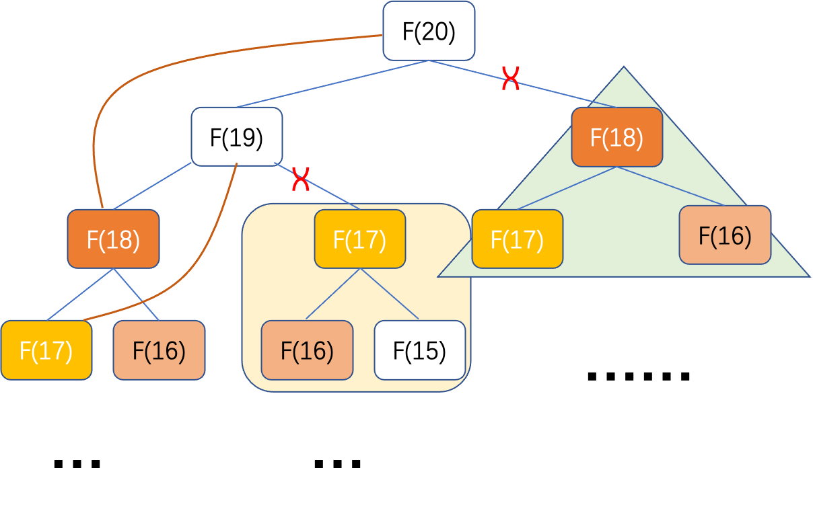

现在，你点进来可能是准备弄清楚啥是动态规划，，，好学的孩子呀，请问你想了解的是金规划还是银规划呀？

很抱歉，本文没有准备将动态规划给讲的透彻，但是如果能让你对动态规划有一些新的体会，那么，这扇门就可以关上了。。。

## **引例**

每当听到动态规划这个词的时候，总有一种抽象，排斥的想法，我们准备先不管TM的动态规划是个啥，家在哪，在哪工作？玩个游戏先，这个游戏叫**爬楼梯**

### 爬楼梯

邻居家的小孩总是爱爬楼梯，有一天你去邻居家做客，看见小朋友又在爬楼梯。你，伫立良久...

这时，阿姨给你洗了个水果，招呼你快坐，你拉着阿姨，深情地看着她，又指了指小朋友，问道：假如你家有$n$ 阶楼梯，才能到达二楼。每次小朋友可以爬 $1 $或 $2$ 个台阶。小朋友有多少种不同的方法可以爬到楼顶呢？

阿姨：...

你能帮阿姨解决这个问题吗？

**分析**

（1）位于一个阶梯时，小朋友都只有俩种选择，下一次爬一个或俩个台阶

（2）爬到终点即结束

（3）凡事不懂，画个图先

假如阿姨家有$20$阶楼梯，爬到第$20$层有$F(20)$种方法


#### 暴力求解

（1）递归遍历所有情况

（2）终止条件为完成了一次完整的爬行过程，计数为1次

（3）叠加所有情况的次数，得到总次数

```txt
climbStairs(int n){
// 自顶向下
// 每次爬1阶或2阶，爬n阶楼梯，总共有多少种方法
// 输入：楼梯数n
// 输出：每次爬1阶或2阶，爬n阶楼梯，总共有多少种方法
// 递归终止条件,n==0时算一次有效爬行方法
  if(n < 0) return 0;
  if(n==0) return 1;
  int allSteps = 0;
  allSteps += climbStairs(steps, n - 1) + climbStairs(steps, n - 2);
  return allSteps;
}
```

在递归的过程中，发现，每次递归总会递归到部分重复的子问题，并且重复的子问题的计算方式依然相同，那么这些重复的计算是否还有必要？可否，每次记录后保存下来，下次直接用？确认这个子问题的结果的状态一旦计算好之后，与后续的状态无关，可以作为直接用的量。



#### 动态规划

```java
	public int climbStairsDp(int[] jumps, int n) {

		int[] dp = new int[n + 1];
		if (n <= 2) {
			return n;
		}

		dp[1] = 1;
		dp[2] = 2;

		for (int i = 3; i <= n; i++) {
			dp[i] = dp[i - 1] + dp[i - 2];
		}

		return dp[n];
	}
```

阿姨长舒一口气，“打完收工...”，


### 跳跃游戏

过了几年，你又被邀请去邻居家做客，注意，你不姓王，这个小朋友恰巧又在家，蹦蹦跳跳，真可爱，阿姨热情地看了看你，开始陷入回忆，那还是几年前了，

你开心的和小朋友玩了掐来，蹦蹦跳跳，真好玩，你问小朋友，一共有5阶台阶，每阶台阶有跳跃的阶数限制，你最初位于第一个阶梯。有这么一个非负整数数组 $nums$ ，数组中的每个元素代表你在该位置可以跳跃的最大长度。你的目标是使用最少的跳跃次数到达数组的最后一个位置。假设你总是可以到达数组的最后一个位置。请问你最少跳几次？

阿姨闻声而来：....

请问你能帮小朋友解决这个问题吗？

输入: $nums = [2,3,1,1,4]$
输出: $2$
解释: 跳到最后一个位置的最小跳跃数是 $2$。
从下标为$ 0 $跳到下标为$ 1$ 的位置，跳 $1$ 步，然后跳 $3$ 步到达数组的最后一个位置。

我们需要求到达第$5$个台阶的最小步数，令为$F(4)$


#### 暴力求解

（1）递归遍历每个位置所有可能跳跃的情况

（2）终止条件：跳完收工

（3）求最少次数，那么**到达当前台阶的最少次数**一定是由**跳到当前台阶的之前的那个台阶的最少次数+1**，比如跳到$F(4)$的最少步数一定是由能跳到$F(4)$的台阶$F(1)$和$F(3)$俩者的最少步数决定，所以记个临时变量，求每一阶台阶的最少次数，算到最后，求最少次数

```txt
jumpGame(int[] nums, int start){
// 自底向上
// 使用最少的跳跃次数到达数组的最后一个位置
// 输入：nums：非负整数数组，数组中的每个元素代表你在该位置可以跳跃的最大长度；start:表示每次跳跃的起点，有效位从0开始
// 输出：到达最后一个位置的最少次数
// 递归终止条件,跳跃起点到达最后一个位置
  if(start >= nums.length - 1) return 0;
  minSteps = Integer.MAX_VALUE;
  for (int i = 1; i <= jumps[start]; i++) {
   // 当前起跳的起点
    cur = start + i;
    steps = jumpGame(nums, cur) + 1;
    if (steps == -1) {
      continue;
    }
    minSteps = min(minSteps, steps);
  }
  if (minSteps != Integer.MAX_VALUE) {
    return minSteps;
  }
	return -1;
}
```

#### 可以优化吗？

分析：同样存在大量重复计算；是否可以避免重复运算？

#### 动态规划

```java
	public int jumpGamesDp(int[] jumps) {
		// 记录每一个位置到达终点的最小步数
		int[] dp = new int[jumps.length];

		for (int i = 0; i < jumps.length; i++) {
			dp[i] = Integer.MAX_VALUE;
		}

		dp[0] = 0;
		for (int i = 0; i < jumps.length; i++) {
			for (int j = 1; j <= jumps[i]; j++) {
				int maxPos = i + j;
				if (maxPos >= jumps.length) {
					break;
				}
				dp[maxPos] = Math.min(dp[maxPos], dp[i] + 1);
			}
		}

		if (dp[jumps.length - 1] == Integer.MAX_VALUE) {
			return -1;
		}
		return dp[jumps.length - 1];
	}
```

小朋友跳了俩步，闯关成功，与此同时，阿姨也收工了，长呼一口气...

#### 对比分析

相较于暴力解法，动态规划通过记忆数组记录重复运算的数据状态。

那TM的是么是动态规划？

是阿姨的功夫还是小朋友的才智，注意你不姓王。。。

**wikipedia大哥是这么说的**

## [定义](https://en.wikipedia.org/wiki/Dynamic_programming)

**Dynamic programming** is both a [mathematical optimization](https://en.wikipedia.org/wiki/Mathematical_optimization) method and a computer programming method. The method was developed by [Richard Bellman](https://en.wikipedia.org/wiki/Richard_Bellman) in the 1950s and has found applications in numerous fields, from [aerospace engineering](https://en.wikipedia.org/wiki/Aerospace_engineering) to [economics](https://en.wikipedia.org/wiki/Economics).

In both contexts **it refers to simplifying a complicated problem by breaking it down into simpler sub-problems in a [recursive](https://en.wikipedia.org/wiki/Recursion) manner**. While some decision problems cannot be taken apart this way, decisions that span several points in time do often break apart recursively. Likewise, in computer science, if a problem can be solved optimally by breaking it into sub-problems and then recursively finding the optimal solutions to the sub-problems, then it is said to have optimal substructure.

[**你的邻居大哥是这么解释的：**](https://www.techiedelight.com/introduction-dynamic-programming/)

**Dynamic programming is a method for solving a complex problem by breaking it down into a collection of simpler subproblems, solving each of those subproblems just once, and storing their solutions using a memory-based data structure (array, map, etc.).** Each subproblem solution is indexed in some way, typically based on its input parameters’ values, to facilitate its lookup. So, the next time the same subproblem occurs, instead of recomputing its solution, one looks up the previously computed solution, thereby saving computation time. This technique of storing solutions to subproblems instead of recomputing them is called `memoization`.


## **思想**

**动态规划方法，是对一种具有重叠子问题的问题进行求解的技术《算法设计与分析基础》**。将给定问题拆解为子问题，递归的去找到子问题的最优解来最优的解决问题，这也被称为最优子结构。每次将子问题的结果保存起来，可以称为记忆化，同时这也是动态规划的核心。

#### 重叠子问题

**如果给定问题可以拆解成多个子问题，且所有子问题都需要用同一种方式求解，那么它们就属于重叠子问题。**

#### 最优子结构

**如果给定问题的最优解可以通过使用其子问题的最优解来获得，则给定问题具有最优子结构性质。 **

#### 无后效性

**如果给定某一阶段的状态，这一阶段以后过程的发展，不受这阶段以前各段状态的影响，就称为无后效性，即：未来与过去无关。**


这几个特点保证了，通过数组形式记忆化记录下来各个子问题的状态结果可以复用，并且原问题可以由子问题的记忆结果计算得到。


### 思考

那么问题就来了，阿姨问了，动态规划和分治有啥区别吗？还有贪心呢？

**是时候表现自己了：**

**分治方法将问题划分为互不相交的子问题**，递归的求解子问题，再将它们的解组合起来，求出原问题的解。

先举一个典型的分治思想的例子

**[归并排序](http://t.zoukankan.com/l199616j-p-10604351.html)**

归并排序就是递归得将原始数组递归对半分隔，直到不能再分（只剩下一个元素）后，开始从最小的数组向上归并排序。


```txt
# 归并排序中的思路
MergeSort(arr[], l,  r)
If r > l
     1. 找到数组中的中间点，把数组分为两部分
             middle m = (l+r)/2
     2. 对数组的左部分调用MergeSort 函数  
             Call mergeSort(arr, l, m)
     3. 对数组的右部分调用MergeSort 函数 
             Call mergeSort(arr, m+1, r)
     4. 合并2,3中的两部分
             Call merge(arr, l, m, r)
```

与之相反，**动态规划应用于子问题重叠的情况**，即不同的子问题具有公共的子子问题（子问题的解是递归进行的，将其划分为更小的子子问题），在这种情况下，分治算法会做很多不必要的工作，会反复的求解哪些公共子问题，而动态规划算法对每个子子问题只求解一次，将其解保存在一个表格中，从而无需每次求解一个子子问题时都需要重新计算，避免了这种不必要的计算工作。《算法导论》

我们在求解最优化问题过程中，但动态规划也有缺点，每个步骤都面临很多选择，很多选择可能是没有必要的，**贪心算法，在每一步都做出当前最佳选择，总是找到局部最优解，寄希望这样的选择可以导致全局最优。**

比如刚才小朋友玩的跳跃游戏,我们使用了数组去记录跳到每个台阶的最少步数，但实际上我们更关心跳到终点位置的最少步数，所以我们可以每次去记录每个位置能跳到的最远位置，如果到达终点了，那么游戏结束。


```java
	public int jumpGamesGa(int[] nums) {
		int end = 0;
		int maxPosition = 0;
		int steps = 0;
		for (int i = 0; i < nums.length - 1; i++) {
			// 贪心：每次找能跳的最远的位置
			maxPosition = Math.max(maxPosition, nums[i] + i);
      // 由于求最少步数，所以只有当前位置到达上一轮能找到的跳的最远位置才更新步数
			if (i == end) { //遇到边界，就更新边界，并且步数加一
				end = maxPosition;
				steps++;
			}
		}
		return steps;
	}
```

总结来说，动态规划和分治都是将大问题划分为小问题，小问题间独立是分治，小问题间有状态关系，并且需要用到之前状态是动态规划，不需要的是贪心法。


**情景小对话**

你：我已经知道了动态规划的精华了，是时候去拳打敬老院，脚踢幼儿园，新的一代小区霸主即将诞生

我：搞不赢的

你：搞得赢的

我：搞不赢的

你：我劝你


## 三个基本例子

那么动态规划，到底难在哪里呢？私以为难在子问题的多样化和抽象化，

下文我们把每个子问题的计算结果称为状态，原问题与子问题的计算关系，称为状态与状态的关系。

（1）但对于可被记录子问题的状态数组来说，无非是用一维和N维来表示。

（2）对于当前状态可选择的选项来说，找出对其直接影响的状态

（3）对于可以使用动态规划问题，画图往往能清晰明了


### 找零问题

最近你在小区楼下开了个小卖店，今天阿姨领着小朋友来买棒棒糖，棒棒糖9块钱，阿姨掏出20块钱，恶狠狠的盯着你骂道：你TM棒棒糖金子做的呀？给我找最少的纸币，我只要1，2，5的纸币，其他的我不要。

我：你可以扫码嘛？

阿姨：扫码？扫码，扫码，。。。扫尼玛

打完收工...

但是生意还是要做的。。。接着找钱

**分析：**

（1）不管零钱多少，均需要拆解成对应面值的硬币，即可被找零的面值硬币固定

（2）每次被找零后，数值会减小，只有当零钱为0了才不需要被找零，除非你是个大善人，


考虑著名的找零问题的一般情形，需要找零金额为$n$,最少要用多少面值为$d_1<d_2<...<d_m$的硬币。假设有$m$种面值为$d_1<d_2<...<d_m$的硬币，$d_1=1$，且每种面值的硬币数量无限可得。

#### 暴力求解

```
coinChange(int[] coins, int amount){
// 自顶向下
// 使用最少的跳跃次数到达数组的最后一个位置
// 输入：coins：非负整数数组，可以被用来找零的零钱价值；amount:表示当前需要找零的金额
// 输出：找零需要的最少硬币数
// 递归终止条件,需要找零的金额为0，则结束，小于0，表示找不开，也结束找零方案
  if (amount == 0) return 0;
  
  if (amount < 0) return -1;
  // 记录需要被找零的最少硬币数
  minChangeNum = Integer.MAX_VALUE;
  // 在这里开始做选择
  for (int coin : coins) {
    changeNum = coinChange(coins, amount - coin);
    if (changeNum == -1) {
      continue;
    }
		minChangeNum = Math.min(minChangeNum, changeNum + 1);
	}
	if (minChangeNum != Integer.MAX_VALUE) {
		return minChangeNum;
	}
  return -1;
}
```

**递推关系**

$$\begin{cases}
F(n)=min\left\{ F(n-d_j)\right\}+1& \text{n>0}\\
F(0)=0& \text{n=0}
\end{cases}$$

```java
ChangeMaking(D[1..m],n)
//应用动态规划算法求解找零问题，找出使硬币加起来等于n时所需的最少的硬币数目
//输入：正整数n，以及用于表示的币值的递增整数数组D[1..m]，D[1]=1
//输出：总金额等于n的硬币的最少的数目
F[0]=0
for(int i = 1; i <= n; i++){
	int tmp = Integer.MAX_VALUE;
	for(int j = 1; j <= m; j++){
  	tmp = Math.min(F[i-D[j]],tmp)
  }
	F[i] = tmp+1;
}Í
return F[n];
```

#### 动态规划

```java
	public int doCoinChangeDp(int[] coins, int n) {
		int[] dp = new int[n + 1];

		for (int i = 1; i < dp.length; i++) {
			dp[i] = Integer.MAX_VALUE;
		}

		for (int i = 1; i <= n; i++) {
			for (int coin : coins) {
				if ((i - coin) < 0) {
					break;
				}
				dp[i] = Math.min(dp[i], dp[i - coin] + 1);
			}
		}
		if (dp[n] == Integer.MAX_VALUE) {
			return -1;
		}
		return dp[n];
	}
```


### 币值最大化问题

小区最近来来一个小偷，你们小区只有一个入口，所以只能先从那家偷，但小区治安好，每俩家之间有一个警报器，如果相邻的俩家同时被偷了，那么警报器就会报警，小偷从小数学比较好，勘查地形后，又和邻居家的阿姨闲聊，套出了咱们小区每家每户室内的金币数额，回到家想着我该怎么偷才能在这和小区偷到最大化的价值的东西呢？

**分析**

（1）相邻金币不可同时获得

（2）要想币值最大化，相邻硬币必定要获得一个

考虑更一般的问题，给定一排$n$个硬币，其面值均为正整数，$c_1,c_2,..c_n$，这些整数并不一定俩俩不同，请问如何选择硬币，是的其在原始位置互不相邻的条件下，所选硬币的总金额最大。**为方便形象化理解，这里[参考](https://leetcode-cn.com/problems/house-robber/solution/dong-tai-gui-hua-jie-ti-si-bu-zou-xiang-jie-cjavap/)了的解释和图形。**


#### 暴力求解

```java
// 自底向上
public class RobberySolution {

	public int maxRobberyMoney(int[] values) {
		return robberyMoney(values, 0);
	}

	public int robberyMoney(int[] values, int start) {
		if (start >= values.length) {
			return 0;
		}

		int maxValue = 0;
		// 在这里开始做选择
		int value = Math.max(values[start] + robberyMoney(values, start + 2), robberyMoney(values, start + 1));
		maxValue += value;
		return maxValue;
	}
}
```


**递推关系**

$F(n)=max \left\{ F(n-2)+c_n, F(n-1) \right\}$

$F(0) = 0, F(1) = c_1$

```java
CoinRow(C[1..n])
//自底向上：求最大金额
//在满足所选硬币不相邻的条件下，从一排硬币中选择最大金额的硬币
//输入：数组C[1..n]保存n个硬币的面值
//输出：可选硬币的最大金额
F[0] = 0
F[1] = C[1]
for(int i = 2; i <= n; i++){
	F[i] = Math.max(C[i]+F[i-2], F[i-1]);
}
return F[n]
```


#### 动态规划

```java
	public int robberyMoneyDp(int[] nums) {
		int n = nums.length;

		int[] dp = new int[n];

		for (int i = 0; i < n; i++) {
			dp[i] = Integer.MIN_VALUE;
		}
		if (n == 1) {
			return nums[0];
		}
		if (n == 2) {
			return Math.max(nums[0], nums[1]);
		}
		dp[0] = nums[0];
		dp[1] = Math.max(dp[0], nums[1]);
		for (int i = 2; i < n; i++) {
			dp[i] = Math.max(nums[i] + dp[i - 2], dp[i - 1]);
		}

		return Math.max(dp[n - 1], dp[n - 2]);
	}

```


#### 空间优化版本

```java
	public int robberyMoneyDp2(int[] nums) {
		int pprev = 0;
		int prev = 0;

		// 每次循环，计算“偷到当前房子为止的最大金额”
		for (int i : nums) {
			// 循环开始时，prev 表示 dp[k-1]，pprev 表示 dp[k-2]
			// dp[k] = max{ dp[k-1], dp[k-2] + i }
			int curr = Math.max(prev, pprev + i);
			pprev = prev;
			prev = curr;
			// 循环结束时，prev 表示 dp[k]，pprev 表示 dp[k-1]
		}

		return prev;
	}
```


### 硬币收集问题

疫情防控期间，你们楼被要求隔离，在家无聊的很，你邀请邻居家的小朋友来家里面玩游戏，这个游戏呢能赚钱，你在$n\times m$格木板种放有一些硬币，每格的硬币数目最多为一个，小朋友在木板左上方需要收集尽可能多的硬币可能多的硬币并把它们带到右下方的单元格。每一步，小朋友可以从当前的位置向右移动一格或向下移动一格。当小朋友遇到一个有硬币的单元格时，就会将这枚硬币收集起来。设计一个算法找出机器人能找到的最大硬币数。

#### 暴力求解

怎么解？你来想想？

```
//RobotCoinCollection(C[1..n,1..m], row, col)
if(row >= m && col == n){
	return 0;
}

return max(RobotCoinCollection(C[1..n,1..m],row+1,col),RobotCoinCollection(C[1..n,1..m],row,col+1)) + C[row, col];
```


#### 动态规划

怎么做？你来想想？

**递推关系**

$$\begin{cases}
F(i,j)=max\left\{ F(i-1,j),F(i,j-1)\right\}+c_{ij}& \text{1<=i<=n,1<=j<=m}\\
F(0,j)=0,1<=j<=m,F(i,0)=0&\text{1<=i<=m}
\end{cases}$$

```java
RobotCoinCollection(C[1..n,1..m])
//利用动态规划算法计算机器人在n*m木板上所能收集的最大硬币数
//机器人从(1,1)出发，每次向右或向下移动，从左上方移动到右下方
//输入：矩阵C[1..n,1..m],矩阵元素为1或0分别表示单元格中有一枚硬币或没有
//输出：机器人在单元格（n,m）中收集到的最大硬币数
F[1,1]=C[1,1]
for(int j=2; j <= m; j++){
	F[1,j] = F[1,j-1]+C[i,j];
}
for(int i = 2; i <= n; i++){
	F[i,1] = F[i-1]+C[i,1]
}
for(int i = 2; i <= n; i++){
	for(int j =2; j <= m; j++){
		F[i,j] = max{F[i-1,j], F[i,j-1]}+C[i,j]
	}	
}
return F[n,m]
```


### 最长公共子序列

给定两个字符串 text1 和 text2，返回这两个字符串的最长 公共子序列 的长度。如果不存在 公共子序列 ，返回 $0$ 。

一个字符串的 子序列 是指这样一个新的字符串：它是由原字符串在不改变字符的相对顺序的情况下删除某些字符（也可以不删除任何字符）后组成的新字符串。

例如，"ace" 是 "abcde" 的子序列，但 "aec" 不是 "abcde" 的子序列。
两个字符串的 公共子序列 是这两个字符串所共同拥有的子序列。

```TXT
输入：text1 = "abcde", text2 = "ace" 
输出：3  
解释：最长公共子序列是 "ace" ，它的长度为 3 。
```


#### 暴力求解

假设$ m<n$， 对于text1，我们可以暴力找出$2^m$次方个子序列，然后依次在text2中匹配，算法的时间复杂度会达到指数级$O(n*2^m)$。显然，暴力求解不太适用于此类问题。

#### 动态规划

```java
	public int longestCommonSubsequence(String text1, String text2) {
		int m = text1.length();
		int n = text2.length();

		if (m == 0 || n == 0) {
			return 0;
		}

		int[][] dp = new int[m + 1][n + 1];

		for (int i = 1; i <= m; i++) {
			char c1 = text1.charAt(i - 1);
			for (int j = 1; j <= n; j++) {
				char c2 = text2.charAt(j - 1);
				if (c1 == c2) {
					dp[i][j] = dp[i - 1][j - 1] + 1;
				} else {
					dp[i][j] = Math.max(dp[i - 1][j], dp[i][j - 1]);
				}
			}
		}

		return dp[m][n];
	}
```

思考：每次计算新的一行的时候, 用到的都是上一行或者本行之前算过的数据, 所以可以优化到一维数组. 如下图:


比如计算$dp[3][2]$的时候, 用到的可能有他的左上角, 正上方, 和左侧数据. 左侧数据是在同一行, 上方数据还未被覆盖,还是上一行的老数据, 所以都可以直接用, 这里唯一注意就是左上方的数据, 因为在计算前一列的时候会被覆盖, 需要在被覆盖之前保存下旧值,因此二维的状态数组可以被优化为一维数组。


**二维DP优化一维DP**

```java
	public int longestCommonSubsequence_1(String text1, String text2) {
		int m = text1.length();
		int n = text2.length();

		if (m == 0 || n == 0) {
			return 0;
		}

		int[] dp = new int[m + 1];

		for (int i = 0; i < m; i++) {
			dp[i] = 0;
		}

		for (int i = 1; i <= m; i++) {
			int upLeft = dp[0];
			int c1 = text1.charAt(i - 1);
			for (int j = 1; j <= n; j++) {
				int tmp = dp[j];
				int c2 = text2.charAt(j - 1);
				if (c1 == c2) {
					dp[j] = upLeft + 1;
				} else {
					dp[j] = Math.max(dp[j - 1], dp[j]);
				}
				upLeft = tmp;
			}
		}
		return dp[n];
	}
```


## 背包问题和记忆功能

动态规划法建议，与其对交叠的子问题一次又一次地求解，还不如对每个较小的子问题只解一次并把结果记录在表中，这样从表中就可以得出原始问题的解。

记忆功能技术试图把自顶向下和自底向上的优势结合起来，对具有重叠子问题的问题求解。它用自顶向下的方式，**对给定问题的必要子问题只作一次求解，并把结果记录在表中。**

### 背包问题

给定$n$个重量为$w_1,w_n$,价值为$v_1,..v_n$的物品和一个承重量为$W$的背包，求这些物品中最有价值的一个子集，并且要能够装到背包中。

让我们来考虑一个由前$i$个物品$(1<=i<=n)$定义的实例，物品重量为$w_1,w_i$,价值为$v_1,..v_i$的物品

$F(i,j)$为该实例的最优解的物品的总价值，即，能够放进承重量为$j$的背包中的前$i$个物品中最有价值子集的总价值


（1）根据定义，在不包括第$i$个物品的子集中，最优子集的价值是$F(i-1,j)$

（2）在包括第$i$个物品的子集中（因此，$j-w_i>=0$）,最优子集是由该物品和前$i-1$个物品中能够放进承重量为$j-w_i$的背包的最优子集组成，这种最优子集的总价值等于$v_i+F(i-1,j-w_i)$

因此
$$
F(i,j)=\begin{cases}max\left\{ F(i-1,j),F(i-1,j-w_i)\right\}, j-w_i>=0 \\
F(i-1,j), j-w_i<0
\end{cases}
$$
当$j>=0$时，$F(0,j) = 0$

当$i>=0$时，$F(i,0) = 0$

我们需要求的是$F(n,W)$

### 记忆化

动态规划涉及问题的解，满足一个用交叠子问题表示的递推关系，直接自顶向下对这样一个递推式求解导致一个算法要不止一次地解公共子问题，因此，效率非常低，一般来说时指数级，甚至更差；另一方面，经典的动态规划方法时自底向上工作的：它用所有较小子问题的解填充表格，但是每个子问题的解只解一次。

这种方法无法令人满意的一面是，在求解给定问题时，有些较小的子问题的解常常不是必需的。

由于这个缺点没有在自顶向下法中表现出来，所以自然而然的希望把自顶向下和自底向上的优势结合起来；

目标是得到这么一种方法，它只对必要的子问题求解，并且只解一次，这种方法存在，以**记忆化功能**为基础

该方法用自顶向下的方式对给定问题求解，但还需要维护一个类似自底向上动态规划使用的表格，一开始的时候，用“nu l l”初始化表中所有单元格，用来表示未被计算过，之后一旦需要计算一个新值，先检查是否被计算过，不为null则直接取值，否则递归调用进行计算，然后把返回的结构记录在表中。


```txt
MFKnapsack(i,j)
//对背包问题实现记忆功能方法
//输入：一个非负整数i表示先考虑的物品数量，一个非负整数j表示背包的承重量
//输出：前i个物品的最优可行子集的价值
//注意：我们把输入数组Weights[1..n],Values[1..n]和表格F[0..n,0,,W]作为全局变量
//除了行0和列0用0初始化外，F的所有单元格都用-1初始化
if F[i,j] < 0
	if j < Weights[i]
		value = MFKnapsack(i-1,j)
	else
	  value = max(MFKnapsack(i-1,j),Values[i]+MFKnapsack(i-1,j-Weights[i]))
  F[i,j] = value
return F[i,j]
```

