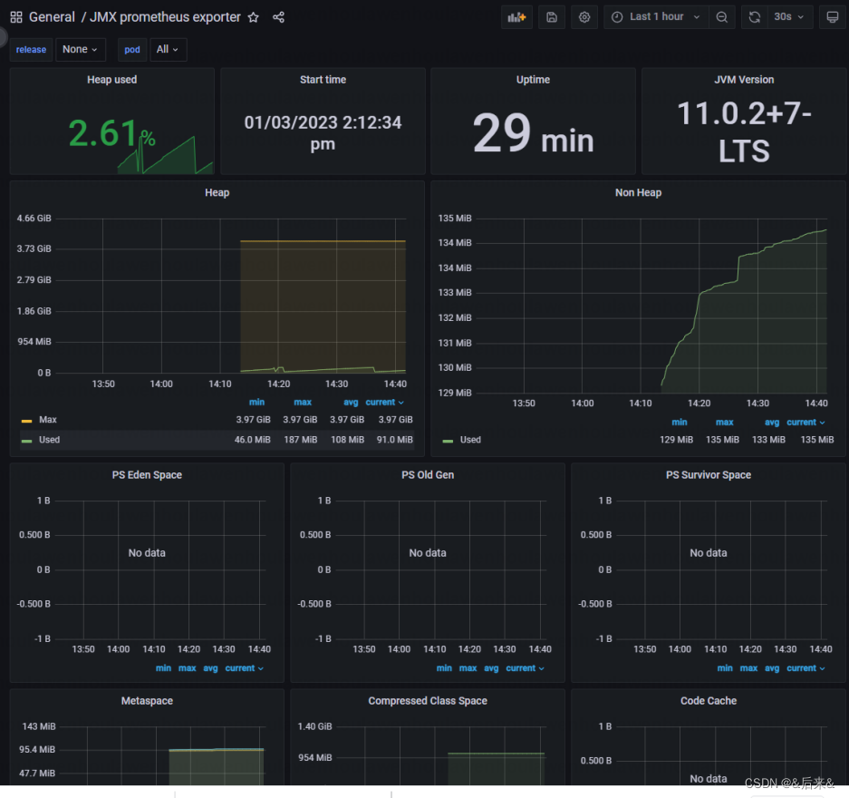

# **基于Prometheus+Grafana搭建性能监测工具**


## **需求**

- 监测数据类型：JVM数据、玩家在线人数、消息时延等

- 接入Prometheus性能监测工具，暴露服务器性能监测数据

- - 模式：pull/push

- 接入Grafana可视化数据

- Prometheus框架图


## 搭建流程
### 准备环境
Java客户端配置

```bash
<!-- The client -->
<dependency>
    <groupId>io.prometheus</groupId>
    <artifactId>simpleclient</artifactId>
    <version>${prometheus.version}</version>
</dependency>
<!-- Hotspot JVM metrics-->
<dependency>
    <groupId>io.prometheus</groupId>
    <artifactId>simpleclient_hotspot</artifactId>
    <version>${prometheus.version}</version>
</dependency>
<!-- Exposition HTTPServer-->
<dependency>
    <groupId>io.prometheus</groupId>
    <artifactId>simpleclient_httpserver</artifactId>
    <version>${prometheus.version}</version>
</dependency>
<!-- Pushgateway exposition-->
<dependency>
    <groupId>io.prometheus</groupId>
    <artifactId>simpleclient_pushgateway</artifactId>
    <version>${prometheus.version}</version>
</dependency>
<!-- JMX Collector-->
<dependency>
    <groupId>io.prometheus.jmx</groupId>
    <artifactId>collector</artifactId>
    <version>${prometheus.jmx.version}</version>
</dependency>
```

### 配置文件
在本文的背景下，需要配置俩个文件：
**1.jmx 的yaml文件，主要用于管理JMX Exporter的数据，即需要暴露的JVM参数；**
[jmx 的yaml文件](https://github.com/jetbrains-infra/prometheus-jmx-exporter/blob/master/config.yml.template)
其中hostPort,username,password可以选择先屏蔽掉

```bash
#hostPort: ${JMX_HOSTPORT}
#username:
#password:
```

**2.prometheus服务器的运行配置文件,注意替换配置文件中的ip和port**
● ip直接设置为本机IP, windows下ipconfig可以查询，Mac下ipconfig
● 在pull模式下，配置的port1为暴露的Http端口
● 在push模式下，配置的port2为push-gateway运行的端口

```bash
global:
  scrape_interval:     15s
  evaluation_interval: 15s
 
scrape_configs:
	# pull mode
  - job_name: game-pull
    static_configs:
      - targets: ['ip:port1']
        labels:
          instance: app-pull
	# push mode
  - job_name: game-push
    static_configs:
      - targets: ['ip:port2']
        labels:
          instance: app-push

```

### 部署 Prometheus

```bash
docker run --name prometheus -d -p 127.0.0.1:9090:9090 prom/prometheus
#指定prometheus配置文件运行
docker run -d -p 9090:9090 -v E://project//hotel//hotel-script//prometheus.yml:/etc/prometheus/prometheus.yml  prom/prometheus
```

### 部署 Prometheus-PushGateWay
[Prometheus-PushGateWay](https://github.com/Prometheus/pushgateway)
```bash
docker pull prom/pushgateway
docker run -d -p 9091:9091 prom/pushgateway
```

部署 Grafana

```bash
docker run -d -p 3000:3000 --name=grafana  grafana/grafana
```

启动后，访问：http://localhost:3000，默认用户名密码 admin/admin。

### 添加 Prometheus 数据源

Settings->Data sources -> Add data source -> Prometheus 

● 在HTTP URL中填写本机IP+Prometheus服务器运行的port.
● HTTP Method选择Get方法

### 常见问题
**1.Error reading Prometheus: An error occurred within the plugin**
将添加数据源的ip设置为本机ip，当设置为localhost时由于容器环境运行的grafana，所以localhost在容器内部可能有自己的定义。

**2.prometheus有数据 grafana无数据**
grafana可以通过PromeSQL语句查询对应的参数

[Prometheus | Grafana导入模板后发现没有数据排查步骤 - 墨天轮](https://www.modb.pro/db/412613)
[prometheus+grafana监控jvm，grafana上没有数据_吃葡萄不吐西瓜皮~的博客-CSDN博客_grafana没有监控数据](https://blog.csdn.net/weixin_52837796/article/details/120768817)


**3 Prometheus Histogram**
prometheus的histogram是一个累计直方图，正常理解直方图的桶内时对应范围（a<x<b）的数据，prometheus的直方图的桶是累计的值，即当前这个桶的数据包含前一个桶，方便函数筛选，用户最后自己想要啥数据，自己用函数筛选；使用计时相关的api单位默认就是秒，自定义的数据类型就是自定义的数据类型对应的单位。
rate(histogram_showcase_metric_bucket[1m]) 查看每个 bucket 的每秒变化率来了解这些 bucket 是如何随时间变化；histogram_quantile() 可以计算出哪个 bucket 标签包含给定的分位数（例如第 95 个百分位数）。


```bash
histogram_quantile(0.95,rate(requests_latency_seconds_bucket[1m]))
```

[一文搞懂 Prometheus 的直方图 - 腾讯云开发者社区-腾讯云](https://cloud.tencent.com/developer/article/1495303)
[深入理解和使用 Prometheus 的 Histogram 指标类型 - 掘金](https://juejin.cn/post/7152837166190739486)
[PromQL 直方图 跟踪请求的延迟或响应大小 99%的请求是在多少延迟下完成的？_富士康质检员张全蛋的博客-CSDN博客_promql 直方图](https://blog.csdn.net/qq_34556414/article/details/123151789)

**4.这俩行代码不在一个线程好像没法用？**

```bash
new PerfCustomCollector().register();
HTTPServer server = new HTTPServer(1234);
```

**5. windows install curl**
假设您是从https://curl.haxx.se/download.html获得的，只需将其解压缩到您想要的任何位置。无需安装。如果您打算使用 SSL，则需要下载 OpenSSL DLL，可从 curl 的网站获得。
下载卷曲压缩包
提取内容（如果您下载了正确的版本，您应该找到 curl.exe）
将 curl.exe 放在您保存软件的文件夹中（例如 D:\software\curl\curl.exe）
从命令行运行 curl
a) 右击“我的电脑”图标
b) 选择属性
c) 点击“高级系统设置”链接
d) 转到选项卡 [高级] - “环境变量”按钮
e) 在系统变量下选择“路径”和“编辑”按钮
f) 添加一个分号，后跟放置 curl.exe 的路径（例如；D:\software\curl）
现在您可以通过键入以下命令从命令行运行：

```bash
curl www.google.com
```

## 参考文档
https://juejin.cn/post/6844904062157062151

https://cloud.tencent.com/developer/article/1495303

https://juejin.cn/post/7152837166190739486

https://blog.csdn.net/qq_34556414/article/details/123151789
