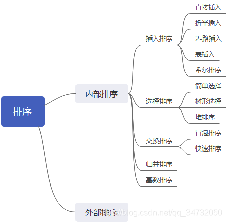

本文将对数据结构中的排序进行归纳学习
## 排序框图整理


通常排序有以下俩种操作：
（1）比较俩个关键字大小
（2)将记录从一个位置移动到另一个位置

## 程序实现

### 插入排序

思想：将序列分为有序和无序俩部分，每次取一无序最左边元素插入有序元素中，一直与其前一元素比较，直至找到合适位置。第一次时，有序元素为array[0]

* 直接插入：

```cpp
void Sort::Swap(T*a, T *b)
{
	T temp = *a;
	*a = *b;
	*b = temp;

}

/*直接插入排序*/
void Sort::InsertSort(T* array, T length)
{
	for (int i = 1; i < length; ++i)
	{
		if (array[i] < array[i - 1])
		{
			Swap(&array[i], &array[i - 1]);
			for (int j = i - 1; j > 0 && array[j] < array[j-1]; --j)
			{
				Swap(&array[j], &array[j - 1]);
			}
		}
	}
}
```
* 折半插入
  思想：直接插入的思想类似，但在查找方式上采用折半查找。

```cpp
void Sort::BInsertSort(T* array, T length)
{
	T tmp;
	for (int i = 1; i < length; ++i)
	{
		tmp = array[i];

		int low = 0;
		int high = i-1;
		while (low <= high)
		{
			int mid = (low + high) / 2;

			if (tmp >= array[mid])
			{
				low = mid + 1;
			}
			else
			{
				high = mid - 1;
			}
		}
		for (int j = i; j >= high + 1; --j)
		{
			array[j] = array[j - 1];
		}		
		//在处理之前使用临时变量存储
		array[high+1] = tmp;//此处易写成array[i],注意此时序列nums已经数值发生变化
	}
}
```
* 二路插入

```cpp
/*减小移动次数*/
void Sort::TInsertSort(T* array, T length)
{
	T arr_tmp[MAX_SIZE];

	int head = 0;
	int tail = 0;

	arr_tmp[0] = array[0];

	for (int i = 1; i < length; ++i)
	{
		if (array[i] < arr_tmp[head])
		{
			head = (head - 1 + length) % length;
			arr_tmp[head] = array[i];
		}
		else if (array[i] > arr_tmp[tail])
		{
			tail++;
			arr_tmp[tail] = array[i];
		}
		else
		{
			tail++;
			arr_tmp[tail] = arr_tmp[tail - 1];
			int j;
			for (j = tail - 1; array[i] < arr_tmp[(j - 1 + length) % length]; 
														j = (j-1+length)%length )
			{
				arr_tmp[j] = arr_tmp[(j - 1 + length) % length];
			}
			arr_tmp[j] = array[i];
		}
	}
	for (int i = 0; i < length; ++i)
	{
		array[i] = arr_tmp[head];
		head = (head + 1) % length;
	}
}
```
#### 希尔排序

* 数据基本有序时，直接插入效率大大提高；
* 由于直接插入排序在n很小时效率比较高；

希尔排序：
	先将整个待排记录序列分割为若干子序列分别进行直接插入排序，待
	整个序列中的记录“基本有序”时，再对全体记录一次直接插入排序

```cpp
void Sort::ShellSort(T* array,int len1, T* delta,  int len2)
{
	//按一定增量来划分序列
	for (int i = 0; i < len2; ++i)
	{
		T tmp = 0;
		T dk = delta[i];
		//在相应序列内进行插入排序
		for (int j = dk; j < len1; ++j)
		{
			if (array[j] < array[j - dk])
			{
				tmp = array[j];
				int k;
				for ( k = j - dk; k >= 0 && tmp < array[k]; k -= dk)
				{
					array[k+dk] = array[k];
;				}
				array[k+dk] = tmp;
			}
		}
	}
}
```
### 交换排序

#### 冒泡排序

```cpp
void Sort::BubbleSort(T *array, int len)
{
	for (int i = 0; i < len - 1; ++i)
	{
		for (int j = 0; j < len - i - 1; ++j)
		{
			if (array[j] > array[j + 1])
				Swap(&array[j],&array[j+1]);
		}
	}
}
```
#### 快速排序

将序列一分为2，递归排序

```cpp
T Sort::Partition(T *array, int low, int high)
{
	T pk = array[low];
	while (low < high)
	{
		while (low < high && array[high] >= pk)
		{
			high--;
		}
		array[low] = array[high];
		while (low < high && array[low] < pk)
		{
			low++;
		}
		array[high] = array[low];
	}
	array[low] = pk;
	return low;
}

void Sort::QuickSort(T *array, int low, int high)
{
	if (low < high)
	{
		int pkloc = Partition(array, low, high);
		QuickSort(array, low, pkloc - 1);
		QuickSort(array, pkloc + 1, high);
	}
}
```
### 选择排序

#### 简单选择排序

思想：每次找到剩余序列中的最小值

```cpp
int Sort::SelectMinKey(T* array, int pos, int len)
{
	T minkey = MAX_VALUE;
	int j = 0;
	for (int i = pos; i < len; ++i)
	{
		if (array[i] < minkey)
		{
			minkey = array[i];
			j = i;
		}
	}
	return j;
}

void Sort::SelectSort(T* array, int len)
{
	for (int i = 0; i < len - 1; ++i)
	{
		int j = SelectMinKey(array, i , len);
		if (j != i)
		{
			Swap(&array[j], &array[i]);
		}
	}
}
```

#### 堆排序

* 创建堆
* 如何建立小堆（完全二叉树来存储）
* 删除堆顶元素后如何更新

```cpp
template<typename T>
void Sort<T>::siftdown(arr &heap, int n, int p)
{
	int i = p;
	int j = 2 * i + 1;
	while (j < n)
	{
		if (j < n - 1 && heap[j] > heap[j + 1])
			j++;
		if (heap[i] <= heap[j])
			break;
		else
		{
			swap(heap[i], heap[j]);
			i = j;
			j = 2 * i + 1;
		}
	}

}
template<typename T>
int Sort<T>::RemoveMinKey(arr& heap, int n)
{
	int key = heap[0];
	heap[0] = heap[n];
	siftdown(heap, n, 0);
	return key;
}

template<typename T>
void Sort<T>::HeapSort(arr& nums, int n)
{
	int heap[MAXSIZE];
	for (int i = 0; i < n; ++i)
	{
		heap[i] = nums[i];
	}
	int spos = n / 2 - 1;
	//建立最小堆结构
	//判断是否有左右子树，有则与其比较，选出最小值，作为父节点
	while (spos--)
	{
		siftdown(heap, n, spos);
	}
	//删除堆顶元素后更新
	for (int i = 0; i < n; ++i)
	{
		nums[i] = RemoveMinKey(heap, n-i-1);
	}

}
```

## 参考文献

《数据结构-C语言版》[严蔚敏,吴伟民版]
