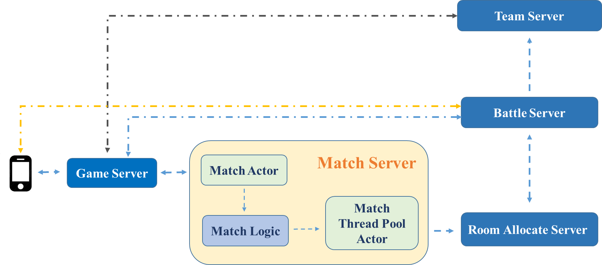
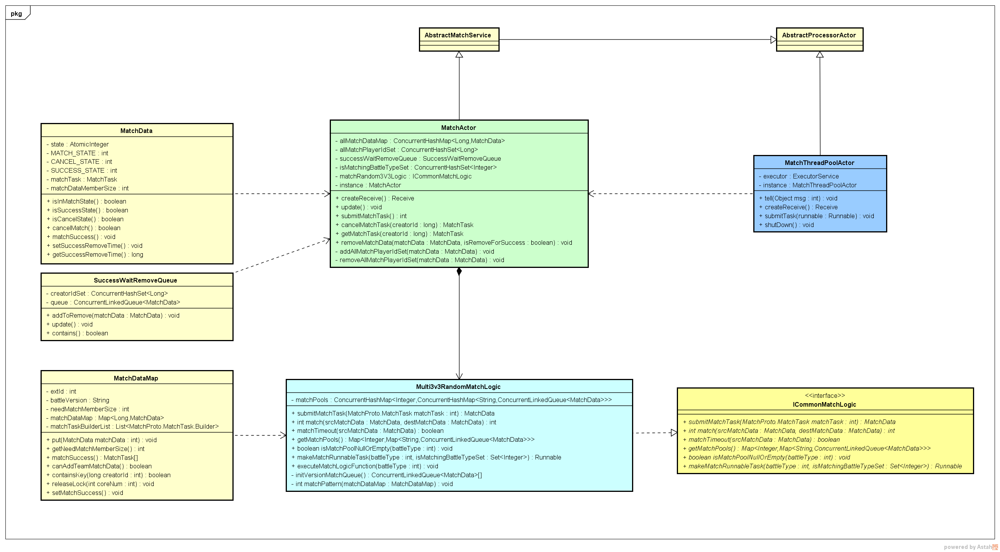

## 匹配需求

玩家可在不同玩法中进行匹配，匹配可分为俩种，组队匹配和单人匹配；

- 单人匹配：玩家直接点击匹配，即可进行匹配倒计时；
- 组队匹配：玩家创建队伍后，点击匹配，组队至多有三人；

流程：玩家提交匹配后，数据加入匹配池后，进入匹配计时界面，匹配成功后进入战斗（可能会匹配机器人）；

## 设计思想

- 将提交匹配和匹配逻辑拆分；（避免阻塞玩家匹配计时界面，匹配逻辑本身是一个耗时的过程）
- 将匹配逻辑拆分成接口，可自定义实现多种方式，依据不同的玩法，指定具体的匹配逻辑；
- 将匹配核心逻辑的具体执行定时封装成RunnableTask发送给线程池，线程池负责执行任务；
- 可针对不同玩法，允许指定匹配核心逻辑是单线程执行匹配或多线程执行。

## 设计框图

## 设计类图

- MatchActor: 负责接收匹配任务，通过指定的匹配逻辑加入具体的匹配池
- MatchThreadActor: 匹配线程池管理器
- ICommonMatchLogic: 通用匹配逻辑接口
- Multi3V3RandomMatchLogic: 3v3随机匹配玩法的匹配逻辑具体实现
- MatchData: 根据提交的MatchTask包装的MatchData, 主要对MatchTask添加了状态
- MatchDataMap: 依据玩法设定的一次成功匹配的MatchData集合
- SuccessWaitRemoveQueue：成功匹配等待移除的队列

