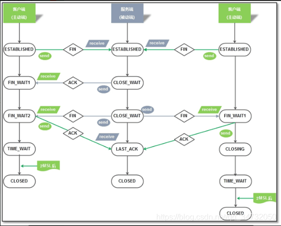

## [转载]原文链接：https://www.tiejiang.org/27040.html

## 服务端客户端通信连接示意图

## 1、 time_wait的作用：
TIME_WAIT状态存在的理由：
1）可靠地实现TCP全双工连接的终止
在进行关闭连接四次挥手协议时，最后的ACK是由主动关闭端发出的，如果这个最终的ACK丢失，服务器将重发最终的FIN，
因此客户端必须维护状态信息允许它重发最终的ACK。如果不维持这个状态信息，那么客户端将响应RST分节，服务器将此分节解释成一个错误（在java中会抛出connection reset的SocketException)。
因而，要实现TCP全双工连接的正常终止，必须处理终止序列四个分节中任何一个分节的丢失情况，主动关闭的客户端必须维持状态信息进入TIME_WAIT状态。

2）允许老的重复分节在网络中消逝
TCP分节可能由于路由器异常而“迷途”，在迷途期间，TCP发送端可能因确认超时而重发这个分节，迷途的分节在路由器修复后也会被送到最终目的地，这个原来的迷途分节就称为lost duplicate。
在关闭一个TCP连接后，马上又重新建立起一个相同的IP地址和端口之间的TCP连接，后一个连接被称为前一个连接的化身（incarnation)，那么有可能出现这种情况，前一个连接的迷途重复分组在前一个连接终止后出现，从而被误解成从属于新的化身。
为了避免这个情况，TCP不允许处于TIME_WAIT状态的连接启动一个新的化身，因为TIME_WAIT状态持续2MSL，就可以保证当成功建立一个TCP连接的时候，来自连接先前化身的重复分组已经在网络中消逝。

## 2、大量TIME_WAIT造成的影响：
在高并发短连接的TCP服务器上，当服务器处理完请求后立刻主动正常关闭连接。这个场景下会出现大量socket处于TIME_WAIT状态。如果客户端的并发量持续很高，此时部分客户端就会显示连接不上。
我来解释下这个场景。主动正常关闭TCP连接，都会出现TIMEWAIT。

### 为什么我们要关注这个高并发短连接呢？
有两个方面需要注意：
1. 高并发可以让服务器在短时间范围内同时占用大量端口，而端口有个0~65535的范围，并不是很多，刨除系统和其他服务要用的，剩下的就更少了。
2. 在这个场景中，短连接表示“业务处理+传输数据的时间 远远小于 TIMEWAIT超时的时间”的连接。

这里有个相对长短的概念，比如取一个web页面，1秒钟的http短连接处理完业务，在关闭连接之后，这个业务用过的端口会停留在TIMEWAIT状态几分钟，而这几分钟，其他HTTP请求来临的时候是无法占用此端口的(占着茅坑不拉翔)。单用这个业务计算服务器的利用率会发现，服务器干正经事的时间和端口（资源）被挂着无法被使用的时间的比例是 1：几百，服务器资源严重浪费。（说个题外话，从这个意义出发来考虑服务器性能调优的话，长连接业务的服务就不需要考虑TIMEWAIT状态。同时，假如你对服务器业务场景非常熟悉，你会发现，在实际业务场景中，一般长连接对应的业务的并发量并不会很高。
综合这两个方面，持续的到达一定量的高并发短连接，会使服务器因端口资源不足而拒绝为一部分客户服务。同时，这些端口都是服务器临时分配，无法用SO_REUSEADDR选项解决这个问题。

### 关于time_wait的反思：
存在即是合理的，既然TCP协议能盛行四十多年，就证明他的设计合理性。所以我们尽可能的使用其原本功能。
依靠TIME_WAIT状态来保证我的服务器程序健壮，服务功能正常。
那是不是就不要性能了呢？并不是。如果服务器上跑的短连接业务量到了我真的必须处理这个TIMEWAIT状态过多的问题的时候，我的原则是尽量处理，而不是跟TIMEWAIT干上，非先除之而后快。
如果尽量处理了，还是解决不了问题，仍然拒绝服务部分请求，那我会采取负载均衡来抗这些高并发的短请求。持续十万并发的短连接请求，两台机器，每台5万个，应该够用了吧。一般的业务量以及国内大部分网站其实并不需要关注这个问题，一句话，达不到时才需要关注这个问题的访问量。

> TCP协议发表：1974年12月，卡恩、瑟夫的第一份TCP协议详细说明正式发表。当时美国国防部与三个科学家小组签定了完成TCP/IP的协议，结果由瑟夫领衔的小组捷足先登，首先制定出了通过详细定义的TCP/IP协议标准。当时作了一个试验，将信息包通过点对点的卫星网络，再通过陆地电缆
> ，再通过卫星网络，再由地面传输，贯串欧洲和美国，经过各种电脑系统，全程9.4万公里竟然没有丢失一个数据位，远距离的可靠数据传输证明了TCP/IP协议的成功。

## 3、案列分析：
首先，根据一个查询TCP连接数，来说明这个问题。
```bash
netstat -ant|awk '/^tcp/ {++S[$NF]} END {for(a in S) print (a,S[a])}'
LAST_ACK 14
SYN_RECV 348
ESTABLISHED 70
FIN_WAIT1 229
FIN_WAIT2 30
CLOSING 33
TIME_WAIT 18122
```

### 状态描述：
CLOSED：无连接是活动的或正在进行
LISTEN：服务器在等待进入呼叫
SYN_RECV：一个连接请求已经到达，等待确认
SYN_SENT：应用已经开始，打开一个连接
ESTABLISHED：正常数据传输状态
FIN_WAIT1：应用说它已经完成
FIN_WAIT2：另一边已同意释放
ITMED_WAIT：等待所有分组死掉
CLOSING：两边同时尝试关闭
TIME_WAIT：另一边已初始化一个释放
LAST_ACK：等待所有分组死掉

### 命令解释：
先来看看netstat：
netstat -n
Active Internet connections (w/o servers)
Proto Recv-Q Send-Q Local Address Foreign Address State
tcp 0 0 123.123.123.123:80 234.234.234.234:12345 TIME_WAIT
你实际执行这条命令的时候，可能会得到成千上万条类似上面的记录，不过我们就拿其中的一条就足够了。

### 再来看看awk：
滤出tcp开头的记录，屏蔽udp, socket等无关记录。
state[]相当于定义了一个名叫state的数组
NF
表示记录的字段数，如上所示的记录，NF等于6
$NF
表示某个字段的值，如上所示的记录，$NF也就是$6，表示第6个字段的值，也就是TIME_WAIT
state[$NF]表示数组元素的值，如上所示的记录，就是state[TIME_WAIT]状态的连接数
++state[$NF]表示把某个数加一，如上所示的记录，就是把state[TIME_WAIT]状态的连接数加一
END
表示在最后阶段要执行的命令
for(key in state)
遍历数组

## 如何尽量处理TIMEWAIT过多?

编辑内核文件/etc/sysctl.conf，加入以下内容：

net.ipv4.tcp_syncookies = 1 表示开启SYN Cookies。当出现SYN等待队列溢出时，启用cookies来处理，可防范少量SYN攻击，默认为0，表示关闭；
net.ipv4.tcp_tw_reuse = 1 表示开启重用。允许将TIME-WAIT sockets重新用于新的TCP连接，默认为0，表示关闭；
net.ipv4.tcp_tw_recycle = 1 表示开启TCP连接中TIME-WAIT sockets的快速回收，默认为0，表示关闭。
net.ipv4.tcp_fin_timeout 修改系默认的 TIMEOUT 时间
然后执行 /sbin/sysctl -p 让参数生效.

/etc/sysctl.conf是一个允许改变正在运行中的Linux系统的接口，它包含一些TCP/IP堆栈和虚拟内存系统的高级选项，修改内核参数永久生效。
简单来说，就是打开系统的TIMEWAIT重用和快速回收。

如果以上配置调优后性能还不理想，可继续修改一下配置：
```bash
vi /etc/sysctl.conf
net.ipv4.tcp_keepalive_time = 1200 
#表示当keepalive起用的时候，TCP发送keepalive消息的频度。缺省是2小时，改为20分钟。
net.ipv4.ip_local_port_range = 1024 65000 
#表示用于向外连接的端口范围。缺省情况下很小：32768到61000，改为1024到65000。
net.ipv4.tcp_max_syn_backlog = 8192 
#表示SYN队列的长度，默认为1024，加大队列长度为8192，可以容纳更多等待连接的网络连接数。
net.ipv4.tcp_max_tw_buckets = 5000 
#表示系统同时保持TIME_WAIT套接字的最大数量，如果超过这个数字，TIME_WAIT套接字将立刻被清除并打印警告信息。
默认为180000，改为5000。对于Apache、Nginx等服务器，上几行的参数可以很好地减少TIME_WAIT套接字数量，但是对于 Squid，效果却不大。此项参数可以控制TIME_WAIT套接字的最大数量，避免Squid服务器被大量的TIME_WAIT套接字拖死。
```
